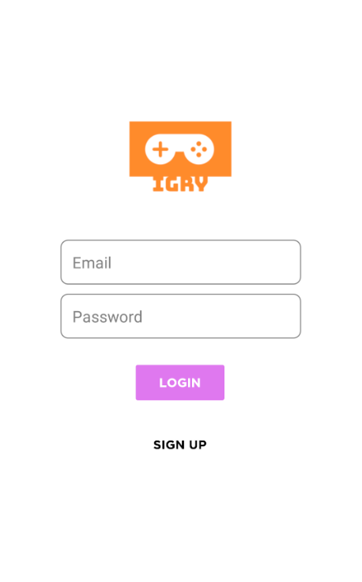
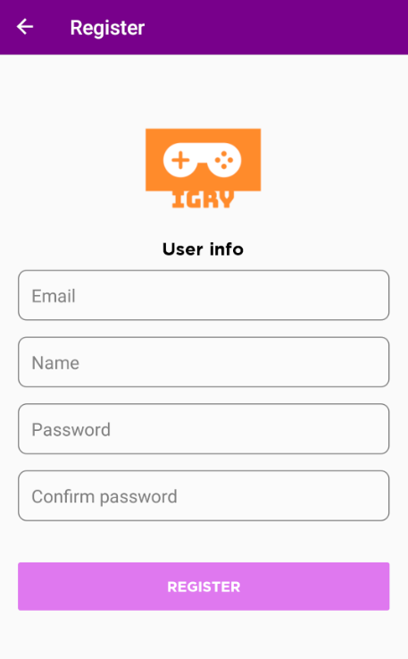
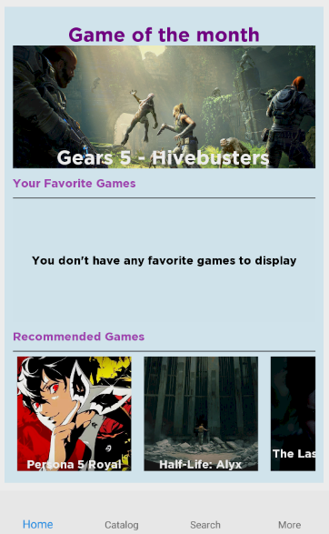
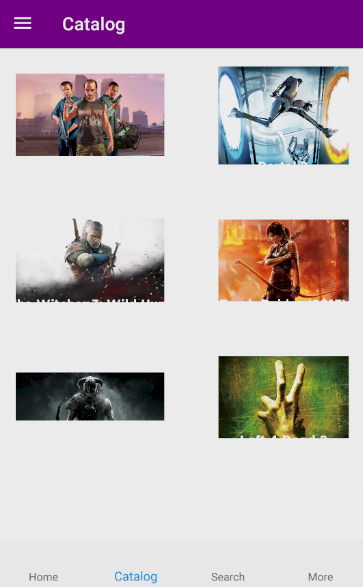
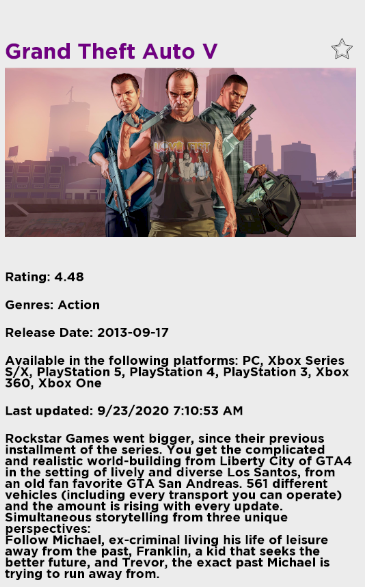
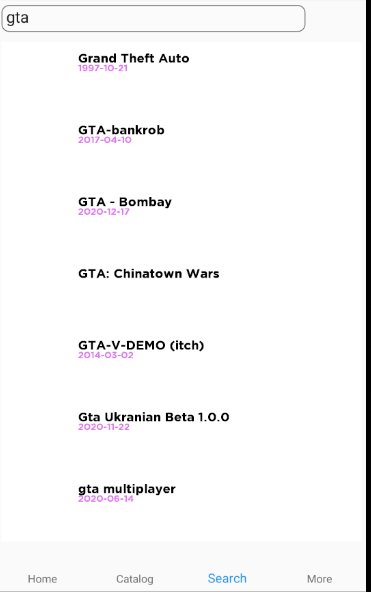
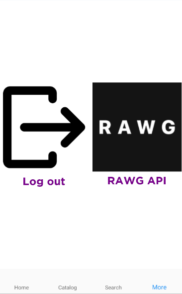

# Igry

Igry is a mobile app done in Xamarin that works a catalog for videogames.
Igry provides information like the latest games, the highest rated games, potential games that you could like and
other miscellaneous stuff related to games. In order to make this work we the [RAWG API], one of the largest video games database 
to date with rich metadata and lots of player activity data.

[RAWG API]: https://api.rawg.io/docs/

	
	

	
	

	
	

	

## Project Resources 

- Balsamiq Mockup: [Here](https://drive.google.com/file/d/1uE7_ESh1S1ydUFxGTis1tfzqxH8LJY4-/view?usp=sharing "Google Drive Link")
- Trello Dashboard: [Here](https://trello.com/b/gyTabiE6/igry "Trello Link")

## Members

- Carlos Roque 1088452
- Juan Henriquez 1075061
- Mariano Vasquez 1087284

## Libraries Used

- Fody
- Prism.Unity
